# Mi Bodega · ABARROTES PRO

**Punto de venta para un puesto de abarrotes por mayor**, pensado para el teléfono Android del dueño: vender rápido y sin equivocarse, llevar el fiado con firma, las entregas a vendedores, la caja y saber si el negocio gana plata. **Funciona sin internet.**

<p align="center">
  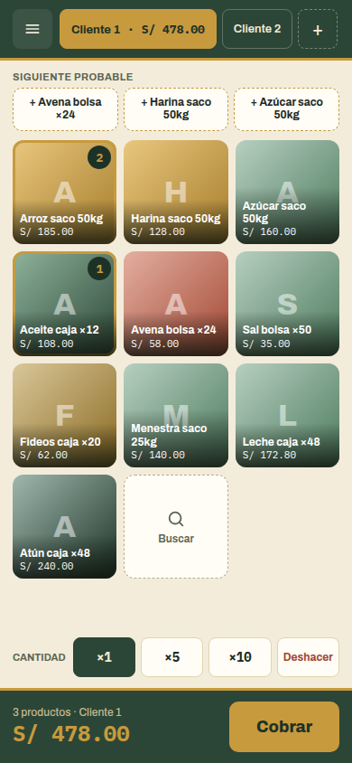
  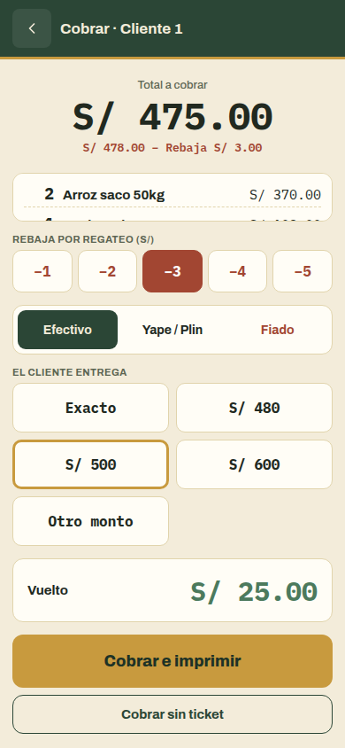
  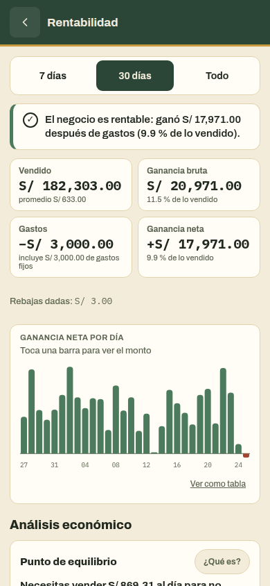
</p>

---

## Contenido

1. [Descargar e instalar](#1-descargar-e-instalar)
2. [Primer día: cómo empezar](#2-primer-día-cómo-empezar)
3. [Qué hace la app, pantalla por pantalla](#3-qué-hace-la-app-pantalla-por-pantalla)
4. [Ganancias y análisis económico](#4-ganancias-y-análisis-económico)
5. [Seguridad del dinero y de los datos](#5-seguridad-del-dinero-y-de-los-datos)
6. [Preguntas frecuentes](#6-preguntas-frecuentes)
7. [Para programadores](#7-para-programadores)
8. [Estado del proyecto](#8-estado-del-proyecto)

---

## 1. Descargar e instalar

### Opción A: APK (recomendada)

1. En el teléfono, abre este link en Chrome:
   **https://github.com/1xmanMAX/ABARROTES-PRO-/releases/download/apk-latest/mi-bodega.apk**
2. Abre el archivo descargado y toca **Instalar**. Si Android pregunta, permite *"instalar apps de esta fuente"*.
3. Aparece **Mi Bodega** en tus aplicaciones.

- Cada vez que se mejora la app, el APK nuevo queda en el **mismo link**.
- **Las versiones nuevas se instalan encima sin borrar tus datos.** No desinstales la app: desinstalar sí borra todo.
- Dentro del APK todavía no se puede imprimir; para imprimir usa la opción B.

### Opción B: desde Chrome (sin instalar el APK)

Si alguien corre la app en una computadora (ver [sección 7](#7-para-programadores)), ábrela en Chrome desde el teléfono. Luego ve al menú ⋮ → **Agregar a pantalla principal**. Así también funciona sin internet y **sí puede imprimir** recibos.

---

## 2. Primer día: cómo empezar

| Paso | Qué hacer | Dónde |
|---|---|---|
| 1 | Crea tu **código de dueño** (4 dígitos que solo tú sabes). | Al abrir la app por primera vez |
| 2 | Carga tus productos con **precio de venta y costo**. Sin costo, la ganancia no es real. | Menú → Inventario |
| 3 | Pon tus **gastos fijos del mes** (alquiler del puesto, luz, ayudante). | Menú → Ajustes |
| 4 | Registra el **saldo inicial** de la caja (el sencillo). | Menú → Caja |
| 5 | Crea a tus **clientes de fiado y vendedores**. Cada uno crea su propio código. | Menú → Clientes y vendedores |
| 6 | ¡A vender! | Pantalla principal |
| 7 | Al cerrar: **cierre del día** (cuentas el efectivo). | Menú → Caja |
| 8 | Una vez por semana: **copia de seguridad**. | Menú → Copia de seguridad |

> **¿Solo quieres probar?** En Ajustes toca **"Cargar datos de ejemplo"**. Carga 10 productos, 30 días de ventas y 2 personas: Rosa (cliente) y Juan (vendedor), los dos con el código **2580**.

<p align="center">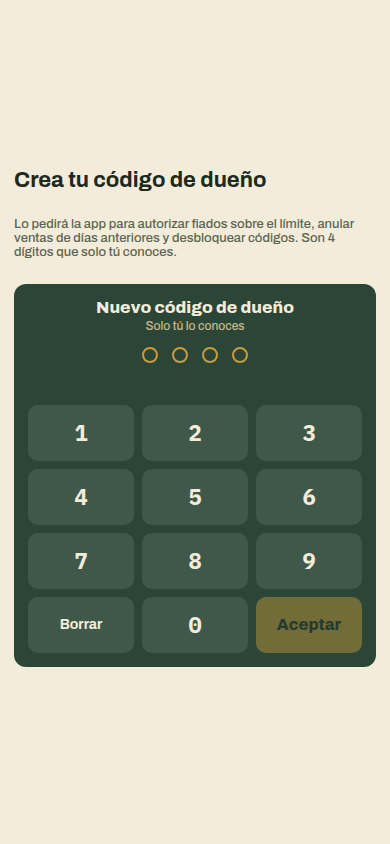</p>

---

## 3. Qué hace la app, pantalla por pantalla

### Vender (pantalla principal)


- **Toca un producto** y se suma 1 al ticket. Un número en la esquina dice cuántos lleva.
- **×5 / ×10:** multiplica el **siguiente** toque. Dos toques lo dejan fijo (🔒).
- **Deshacer:** revierte el último toque, las veces que haga falta.
- **Mantener presionado** un producto: cantidad exacta o precio especial.
- **Siguiente probable:** 3 botones con lo que el cliente suele llevar junto con lo que ya pidió (con arroz, aceite y avena).
- **Pestañas arriba:** atiende a varios clientes a la vez (hasta 6). Mantén presionada una pestaña para ponerle nombre ("Señora del puesto 14").
- **La cuadrícula no cambia de orden mientras atiendes**, para que el dedo siempre encuentre el producto. Se ordena sola por lo más vendido al empezar el día.
- No deja vender más que el stock, sumando todos los tickets abiertos.

Una venta típica de 3 productos se hace en **5 toques**: 3 productos → Cobrar → Cobrar sin ticket.

<br clear="right">

### Cobrar


- **Lista grande de lo que lleva**, para leérsela al cliente y no cobrar de menos.
- **Rebaja por regateo:** botones de −S/ 1 a −S/ 5, en un toque. Solo para productos marcados "admite rebaja".
- **Efectivo:** Exacto, billetes rápidos (S/ 480, 500, 600…) u Otro monto. El **vuelto** sale en grande; si falta plata, dice **"Falta S/ X"** y no deja cobrar.
- **Yape / Plin:** con los últimos 3 dígitos de la operación (opcional).
- **Fiado:** ver abajo.
- Después de cobrar, un aviso de 3 segundos permite **Deshacer** la venta.

<br clear="right">

### Fiado con firma

<p>
  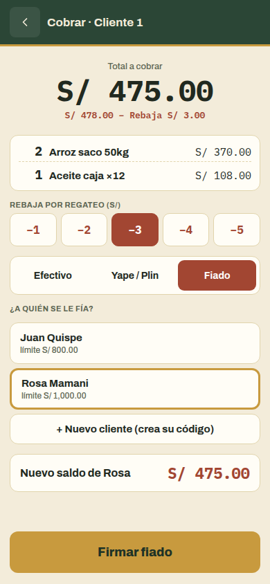
  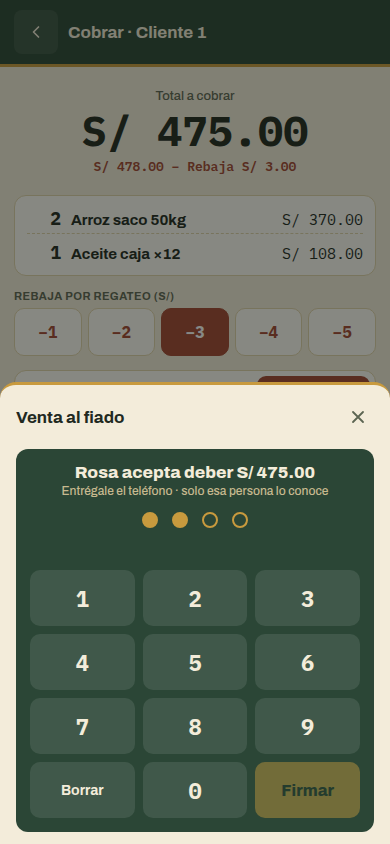
  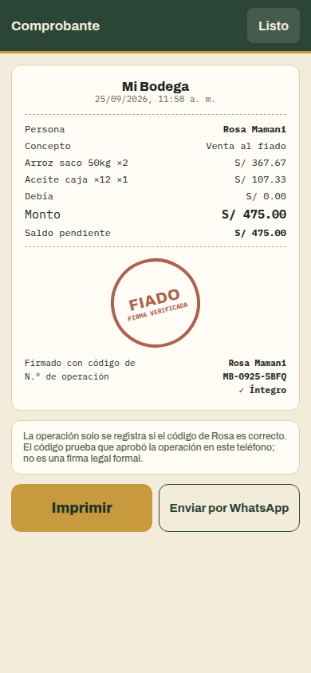
</p>

1. En Cobrar eliges **Fiado** y a la persona. Ves su deuda, su límite y el **nuevo saldo**.
2. **La persona escribe su código** en el teléfono. Sin código correcto, no se guarda nada.
3. Si pasa su límite, **tú autorizas** con tu código de dueño.
4. Sale un **comprobante sellado** (FIADO / PAGADO / RECIBIDO) con n.º de operación, que se puede **imprimir** o **enviar por WhatsApp**.

Para **cobrar una deuda**: Clientes y vendedores → la persona → **Cobrar deuda** (todo o una parte). La persona firma con su código.

### Clientes y vendedores

<p>
  
  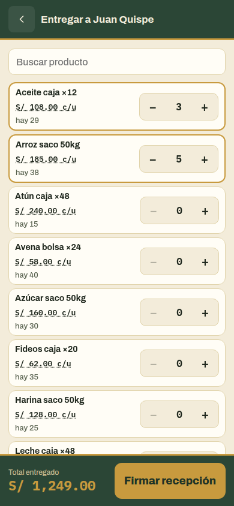
  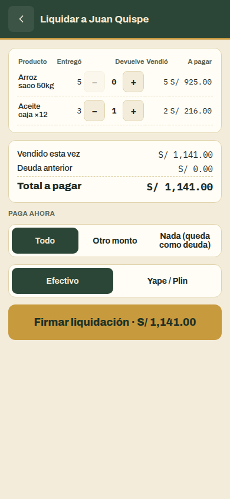
</p>

- **Lista** con lo que debe cada uno y la mercadería que tiene cada vendedor.
- **Entregar mercadería a un vendedor:** productos, cantidades, **precio pactado** (la app recuerda el último) y fecha de liquidación. El vendedor firma que la recibió; todavía no debe nada.
- **Liquidar:** por producto se marca cuánto **devuelve**. Lo demás cuenta como **vendido**. Total a pagar = lo vendido + la deuda anterior. Puede pagar todo, una parte o nada, y firma.
- Las entregas vencidas se marcan en rojo en la ficha y en Inicio.

### Inventario

<p>
  
  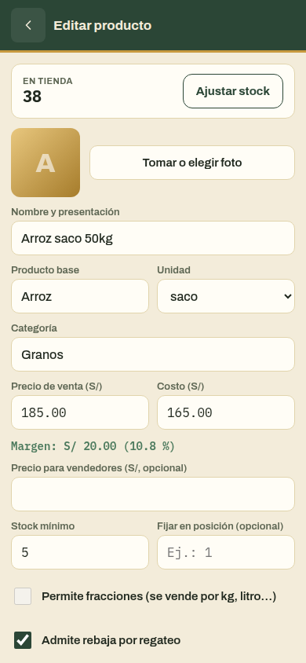
</p>

- Cada producto tiene nombre, foto (opcional), precio de venta, **costo**, precio para vendedores, stock mínimo, si se vende por kilo, si **admite rebaja** y una posición fija en la cuadrícula.
- Al editar un producto se ve el **margen**.
- **Ajustar stock** con motivo (conteo, merma, regalo): queda registrado, no se "edita" el stock.
- Se ve cuánto hay en tienda y cuánto con vendedores: *"30 en tienda · 10 con vendedores"*.

### Caja

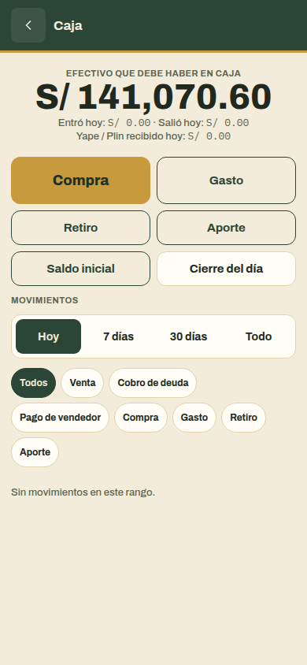

- **Efectivo que debe haber en caja**, lo que entró y salió hoy, y Yape/Plin aparte.
- **Compra a proveedor:** suma al stock, resta de la caja y actualiza el costo.
- **Gasto** (transporte, estiba, bolsas…), **Retiro** (plata que sacas para ti: no es gasto), **Aporte** y **Saldo inicial**.
- **Cierre del día:** cuentas el efectivo y la app te dice si **sobra o falta**.
- **Movimientos** filtrados por tipo y por fecha. Lo registrado a mano se anula con motivo.

<br clear="right">

### Inicio

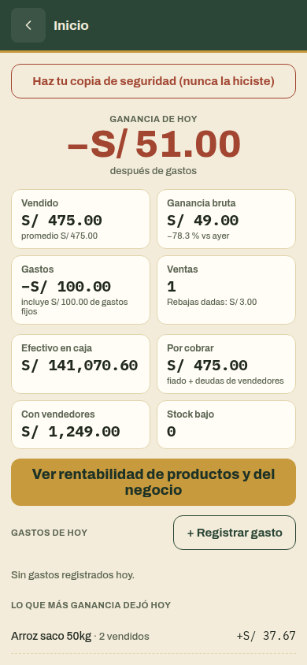

El resumen del día:
- **Ganancia de hoy** después de gastos.
- Lo vendido, la ganancia bruta, los gastos, el número de ventas y las rebajas dadas.
- **Efectivo en caja**, lo que **te deben**, la mercadería con vendedores y el **stock bajo**.
- Entregas vencidas y los productos que más ganancia dejaron hoy.
- Registrar gastos del día.

<br clear="right">

---

## 4. Ganancias y análisis económico

Menú → **Rentabilidad** (7 días, 30 días o todo). La app responde en una frase **si el negocio es rentable** y cómo va frente al periodo anterior. Además muestra el gráfico de ganancia por día y el **veredicto de cada producto**:

| Veredicto | Qué significa | Qué hacer |
|---|---|---|
| ★ **Estrella** | Está entre los que dejan la mitad de tu ganancia | Que nunca te falte |
| ✓ **Bien** | Se vende y deja ganancia | Seguir igual |
| ⏳ **Se mueve lento** | Tienes stock para más de 60 días | Compra menos la próxima vez |
| ↓ **Margen bajo** | Deja menos del 5 % | Revisa el precio o el costo |
| ✕ **Pierde** | Se vende al costo o con pérdida | Sube el precio o no lo rebajes |
| ∅ **Sin ventas** | No se vendió en el periodo | Considera dejar de traerlo |
| ? **Sin costo** | No tiene costo registrado | Ponle el costo en Inventario |

Los indicadores se basan en herramientas conocidas de economía y gestión. Cada uno tiene su gráfico y un botón **"¿Qué es?"** que lo explica en la app.

<table>
<tr>
<td width="50%">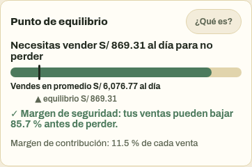</td>
<td>

**Punto de equilibrio** (análisis costo-volumen-utilidad)

*"Necesitas vender S/ X al día para no perder."* Es tus gastos ÷ el margen de contribución (lo que deja cada sol vendido después de pagar la mercadería). El **margen de seguridad** dice cuánto pueden bajar tus ventas antes de perder.

</td>
</tr>
<tr>
<td>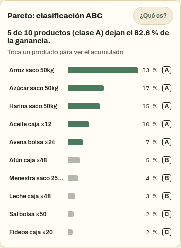</td>
<td>

**Pareto / clasificación ABC** (regla 80/20)

Pocos productos dejan casi toda la ganancia. **Clase A:** el 80 % de la ganancia (cuídalos). **B:** el siguiente 15 %. **C:** el resto (revisa si valen el espacio y la plata parada).

</td>
</tr>
<tr>
<td>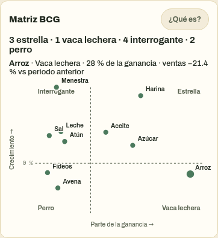</td>
<td>

**Matriz BCG** (Boston Consulting Group), adaptada al puesto

Cada producto en un cuadrante según cuánta ganancia deja y si sus ventas crecen:
- **Estrella:** deja mucho y crece.
- **Vaca lechera:** deja mucho pero ya no crece; mantenla.
- **Interrogante:** deja poco pero crece; obsérvala.
- **Perro:** deja poco y no crece; es candidato a dejar de traerlo.

</td>
</tr>
<tr>
<td>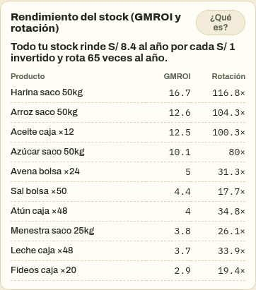</td>
<td>

**GMROI y rotación de inventario** (comercio minorista)

Cuántos soles de ganancia al año deja **cada sol que tienes metido en stock**, y cuántas veces al año se vende y repone. Un GMROI menor a 1 significa que esa plata rinde poco.

</td>
</tr>
</table>

Para que los números sean reales: **pon el costo** de cada producto, los **gastos fijos del mes** en Ajustes y **registra los gastos** del día. Los detalles y aproximaciones de cada cálculo están en [`PLAN.md`](PLAN.md).

---

## 5. Seguridad del dinero y de los datos

- **El dinero se calcula en céntimos enteros:** nunca hay errores de redondeo en el vuelto ni en los totales.
- **Nada se borra:** ventas, gastos y movimientos se **anulan con motivo** y queda el rastro.
- **Cada operación es completa o no pasa:** una venta descuenta el stock, registra la caja y actualiza todo junto; si algo falla, no se guarda nada a medias.
- **El fiado, las entregas y los cobros exigen el código de la persona.** El código no se guarda, solo una huella cifrada (PBKDF2). 3 intentos fallidos bloquean el código 5 minutos; con 6 fallos en 24 horas, solo el dueño puede desbloquearlo.
- **Tu código de dueño** se pide para: fiar sobre el límite, anular ventas de días anteriores, cambiar o desbloquear códigos y crear o restaurar copias.
- **Copia de seguridad cifrada** (Menú → Copia de seguridad): un archivo cifrado (AES-256) con tu código de dueño, para enviarte por WhatsApp o Drive. La app te lo recuerda cada semana.

<p align="center">
  
  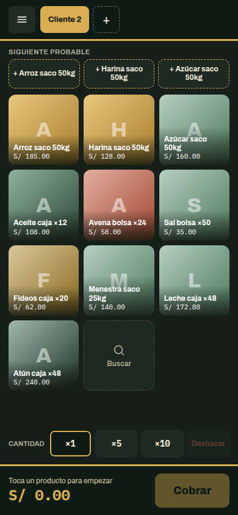
</p>

> **Importante:** todos los datos viven **solo en tu teléfono**. Si se pierde o se malogra sin copia, se pierden. **Haz la copia cada semana.**
>
> El código de 4 dígitos prueba que la persona aprobó la operación en tu teléfono; no es una firma legal formal.

---

## 6. Preguntas frecuentes

**¿Necesito internet?**
No. La app funciona completa sin señal. Solo se necesita internet para descargar el APK y para mandar la copia por WhatsApp.

**Toqué ×10 y no pasó nada.**
El ×10 se aplica al **siguiente** producto que toques. Primero ×10, después el producto.

**Me equivoqué al cobrar.**
Justo después de cobrar, toca **Deshacer** en el aviso. Si ya pasó el aviso, ve a Menú → Historial de ventas → la venta → **Anular venta**. Las de días anteriores piden tu código de dueño.

**Un cliente olvidó su código.**
En su ficha → **Cambiar código**. Tú escribes tu código de dueño y la persona crea uno nuevo.

**¿Por qué la ganancia de hoy sale negativa?**
Porque ya se descontó la parte del día de tus gastos fijos (alquiler, luz…). Es normal en días de pocas ventas; mira la Rentabilidad de 30 días.

**¿Puedo usarla en dos teléfonos?**
Todavía no: es para un solo teléfono. La sincronización en la nube es una fase opcional pendiente.

**Actualicé la app, ¿perdí algo?**
No. Instalar el APK nuevo encima conserva todo. Solo desinstalar borra los datos.

---

## 7. Para programadores

### Tecnología

| Área | Elección |
|---|---|
| App | React 19 + TypeScript (estricto) + Vite 8 |
| Offline | PWA con `vite-plugin-pwa` (Workbox) y fuentes incluidas |
| Base de datos | IndexedDB con **Dexie 4** (transacciones, migraciones v1→v5) |
| Estado de pantalla | Zustand (carrito, tickets en espera); lecturas con `useLiveQuery` |
| Criptografía | WebCrypto: PBKDF2-SHA256 (códigos), SHA-256 (firmas), AES-GCM (copias) |
| APK | Capacitor 8 (Android), compilado por GitHub Actions |
| Tests | Vitest + fake-indexeddb (101 tests), Playwright en 390×844 (14 flujos) |

### Estructura

```
app/
  src/
    domain/      lógica pura y probada: dinero, carrito, predicción, código, saldos,
                 consignación, caja, ganancias, indicadores económicos, respaldo
    db/          esquema Dexie y una función por operación atómica
                 (cobrar, fiar, cobrar deuda, entregar, liquidar, comprar, cerrar caja…)
    features/    pantallas: sell, inventory, parties, consign, cash, stats, backup, history, settings
    ui/          componentes: Sheet, NumPad, PinPad, BarChart, Meter, ParetoChart, ScatterChart…
    i18n/es-PE.ts  todos los textos de la interfaz
  e2e/           flujos completos en el navegador (y el generador de capturas)
  android/       proyecto Android (Capacitor)
mi-bodega-handoff/  especificación original: SPEC, modelo de datos, diseño, mockups
PLAN.md          fases, decisiones tomadas y propuestas pendientes
docs/capturas/   imágenes de este README
```

### Comandos

```bash
cd app
npm install
npm run dev            # servidor en la red local: ábrelo desde el teléfono (http://IP-de-tu-PC:5173)
npm test               # tests de dominio y base de datos
npm run e2e            # flujos en viewport de teléfono
npm run build && npm run preview   # PWA instalable y offline
npm run build:android  # copia la web al proyecto Android
npm run capturas       # regenera las imágenes del README
```

### APK automático

Cada push a `main` o a `claude/**` que toque `app/` dispara [`.github/workflows/android-apk.yml`](.github/workflows/android-apk.yml). El workflow corre los tests, compila el APK y lo publica en la release [`apk-latest`](https://github.com/1xmanMAX/ABARROTES-PRO-/releases/tag/apk-latest). El APK se firma siempre con la misma clave de desarrollo (`app/android/app/mibodega-debug.keystore`), así las actualizaciones se instalan encima. Para publicar en Play Store haría falta una clave privada aparte.

### Reglas del código

Están en [`mi-bodega-handoff/CLAUDE.md`](mi-bodega-handoff/CLAUDE.md). Las principales:
- el dinero va siempre en céntimos enteros;
- cada operación de negocio es una sola transacción;
- nada se borra, se anula;
- las ventas guardan una copia del nombre, el precio y el costo de ese momento;
- los textos van en español de Perú y el código en inglés.

---

## 8. Estado del proyecto

| Fase | Contenido | Estado |
|---|---|---|
| 1 | Vender, cobrar, inventario, recibo, offline | ✅ |
| 2 | "Siguiente probable" y orden por popularidad | ✅ |
| — | Rebaja por regateo y protecciones contra cobrar de menos | ✅ |
| 3 | Clientes, código personal, fiado y cobro de deudas con comprobante | ✅ |
| 4 | Entregas a vendedores y liquidación | ✅ |
| 5 | Caja, compras, cierre del día, inicio, ganancias, rentabilidad y análisis económico | ✅ |
| 6a | Copia de seguridad cifrada con recordatorio semanal | ✅ |
| 6b | Impresión directa por Bluetooth (ESC/POS) | Pendiente (opcional) |
| 6c | Sincronización en la nube para dos teléfonos | Pendiente (opcional) |

Decisiones tomadas y propuestas abiertas: [`PLAN.md`](PLAN.md).
