<p align="center">
  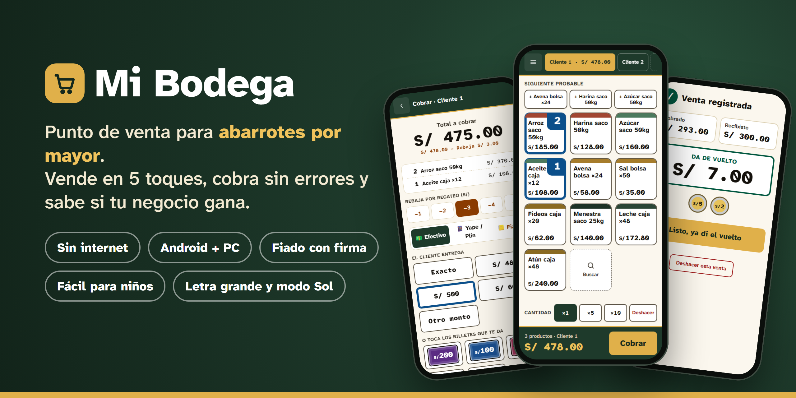
</p>

<p align="center">
  <a href="https://github.com/1xmanMAX/ABARROTES-PRO-/releases/download/apk-latest/mi-bodega.apk"></a>
  <a href="https://1xmanmax.github.io/ABARROTES-PRO-/"></a>
  <a href="#9-para-programadores"></a>
</p>

<p align="center">
  <a href="https://github.com/1xmanMAX/ABARROTES-PRO-/actions/workflows/android-apk.yml"></a>
  
  
  
  
</p>

<h3 align="center">Vende en 5 toques · cobra sin errores · fía con firma · sabe si tu negocio gana</h3>

**Mi Bodega** es un punto de venta hecho para un **puesto de abarrotes por mayor** en el mercado. Corre en el teléfono Android del dueño y en la PC, **funciona sin internet** y está pensado para que lo pueda usar cualquiera de la familia: el dueño con apuro, un familiar que ve poco o un hijo que ayuda a atender.

---

## Contenido

| | | |
|---|---|---|
| 🌟 [Por qué Mi Bodega](#1-por-qué-mi-bodega) | 🛒 [Así se hace una venta](#2-así-se-hace-una-venta) | 📲 [Instalar](#3-instalar) |
| 🚀 [Primer día](#4-primer-día-paso-a-paso) | 📱 [Todas las funciones](#5-todas-las-funciones) | 👀 [Fácil de ver y de usar](#6-fácil-de-ver-y-de-usar) |
| 📈 [Ganancias y análisis](#7-ganancias-y-análisis-económico) | 🔒 [Seguridad](#8-seguridad-del-dinero-y-de-los-datos) | 💻 [Para programadores](#9-para-programadores) |

---

## 1. Por qué Mi Bodega

<table>
<tr>
<td width="33%" valign="top">

### ⚡ Rápida
Una venta de 3 productos en **5 toques**. La app **adivina lo que el cliente lleva** con lo que ya pidió, y los productos más vendidos quedan siempre a la mano.

</td>
<td width="33%" valign="top">

### ✅ Sin errores
El **vuelto sale dibujado** en billetes y monedas. No deja cobrar si falta plata, **tocar dos veces no cobra dos veces** y avisa de los **Yape falsos**.

</td>
<td width="33%" valign="top">

### 📶 Sin internet
Todo funciona **sin señal**. El celular y la PC se **sincronizan por Wi-Fi** y la copia de seguridad va **cifrada**.

</td>
</tr>
<tr>
<td valign="top">

### ✍️ Fiado con firma
Cada cliente **firma con su código** en tu teléfono y recibe un **comprobante sellado** por WhatsApp. Se acabaron las peleas por el cuaderno.

</td>
<td valign="top">

### 👨‍👩‍👧 Para toda la familia
**Modo ayudante** para los hijos (solo vender), **letra grande**, **modo Sol** para leer al aire libre y **voz** que dice el total y el vuelto.

</td>
<td valign="top">

### 📊 Sabes si ganas
Ganancia del día después de gastos, **qué producto gana y cuál pierde**, punto de equilibrio, Pareto, BCG y GMROI, explicados en palabras simples.

</td>
</tr>
</table>

---

## 2. Así se hace una venta

<p align="center">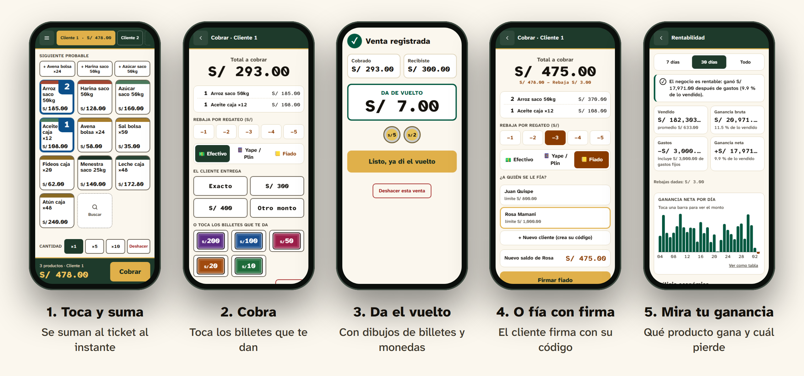</p>

> **Venta típica:** Arroz → Aceite → Azúcar → **Cobrar** → **Cobrar sin ticket**. Son **5 toques** y ya está registrada, con el stock descontado y la caja al día.

---

## 3. Instalar

<table>
<tr>
<td width="50%" valign="top">

### 📱 En el teléfono Android (recomendado)

1. En el teléfono, abre en Chrome:<br>
   **[⬇️ Descargar mi-bodega.apk](https://github.com/1xmanMAX/ABARROTES-PRO-/releases/download/apk-latest/mi-bodega.apk)**
2. Abre el archivo y toca **Instalar**. Si Android lo pide, permite *"instalar apps de esta fuente"*.
3. Listo: aparece **Mi Bodega** en tus aplicaciones.

✅ Las versiones nuevas van en **el mismo link** y se instalan **encima sin borrar tus datos**.<br>
⚠️ No desinstales la app: desinstalar sí borra todo.

</td>
<td width="50%" valign="top">

### 💻 En la PC

**Como programa de Windows (recomendado):**
```powershell
powershell -ExecutionPolicy Bypass -File pc\instalar-windows.ps1
```
Crea el acceso directo **Mi Bodega** en el escritorio. Se abre en una ventana de **Comet** (o Edge o Chrome) y casi no consume memoria. Los datos quedan en `%LOCALAPPDATA%\MiBodega\datos`.

**O en el navegador:** abre **[1xmanmax.github.io/ABARROTES-PRO-](https://1xmanmax.github.io/ABARROTES-PRO-/)** y toca **Instalar** (⊕) en la barra de direcciones.

</td>
</tr>
</table>

<p align="center">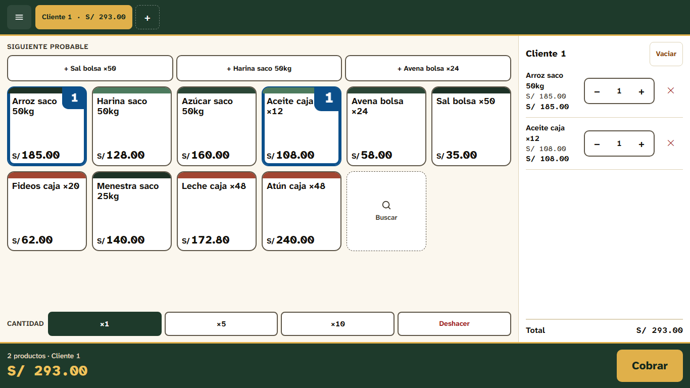</p>

<p align="center"><i>En la PC el ticket queda siempre a la derecha. Escribe el nombre del producto y pulsa <b>Enter</b> para venderlo (por ejemplo: <code>arr</code> + Enter suma un arroz).</i></p>

### 🔄 Celular y PC sincronizados por Wi-Fi

Con el programa de Windows instalado:
1. En la PC abre **Menú → Sincronizar con la PC**.
2. En el celular abre **Menú → Sincronizar con la PC → Escanear QR**.

Desde ahí se sincronizan solos: al abrir la app, cada 5 minutos y unos segundos después de cada venta. **No hace falta internet**, solo estar en el mismo Wi-Fi. Si se vendió en los dos a la vez, se juntan todas las ventas y el stock descuenta ambas. La PC guarda un respaldo por día de los últimos 30 días.

<details>
<summary><b>Diferencias entre Android y PC</b></summary>

| Función | Android (APK) | PC / navegador |
|---|---|---|
| Vender, cobrar, fiado, entregas, caja, rentabilidad | ✅ | ✅ |
| Sin internet | ✅ | ✅ (después de abrirla una vez) |
| Imprimir recibos y comprobantes | ✅ (sistema de impresión de Android) | ✅ (impresora de la PC) |
| Copia de seguridad | ✅ Se comparte por WhatsApp o Drive | ✅ Se descarga el archivo |
| Foto de producto | ✅ Cámara o galería | ✅ Archivo o cámara web |
| Comprobante por WhatsApp | ✅ | ✅ WhatsApp Web |
| Leer en voz alta | ✅ Voz del teléfono | ✅ Voz del navegador |
| Escribir con el teclado | — | ✅ |
| Vibración al tocar | ✅ | — |

</details>

---

## 4. Primer día, paso a paso

| Paso | Qué hacer | Dónde |
|:---:|---|---|
| 1️⃣ | Crea tu **código de dueño** (4 dígitos que solo tú sabes). | Al abrir por primera vez |
| 2️⃣ | Carga tus productos con **precio de venta y costo**. Sin el costo, la ganancia no es real. | Menú → Inventario |
| 3️⃣ | Anota tus **gastos fijos del mes** (alquiler del puesto, luz, ayudante). | Menú → Ajustes |
| 4️⃣ | Registra el **saldo inicial** de la caja (el sencillo). | Menú → Caja |
| 5️⃣ | Registra a tus **clientes de fiado y vendedores**. Cada uno crea su propio código. | Menú → Clientes y vendedores |
| 6️⃣ | **¡A vender!** | Pantalla principal |
| 7️⃣ | Al cerrar, haz el **cierre del día** (cuentas el efectivo). | Menú → Caja |
| 8️⃣ | Una vez por semana, haz la **copia de seguridad**. | Menú → Copia de seguridad |

> 💡 **¿Solo quieres probar?** En **Ajustes** toca **"Cargar datos de ejemplo"**. Carga 10 productos, 30 días de ventas y dos personas: Rosa (cliente) y Juan (vendedor). El código de los dos es **2580**.

---

## 5. Todas las funciones

### 🛒 Vender

<table>
<tr>
<td width="300">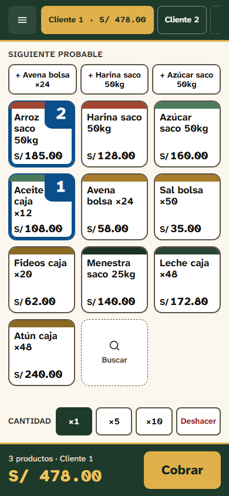</td>
<td valign="top">

- **Toca un producto** y se suma al ticket. El número grande de la esquina dice cuántos lleva.
- **×5 / ×10** multiplica el **siguiente** toque. Con dos toques queda fijo 🔒.
- **Deshacer** revierte el último toque, las veces que haga falta.
- **Mantén presionado** un producto para escribir la cantidad exacta o un precio especial.
- **Siguiente probable:** 3 botones con lo que el cliente suele llevar junto con lo que ya pidió.
- **Pestañas arriba:** atiende hasta a **6 clientes a la vez**. Mantén presionada una pestaña para ponerle nombre ("Señora del puesto 14").
- **La cuadrícula no se mueve mientras atiendes.** Se ordena sola por lo más vendido al empezar el día.
- No deja vender más de lo que hay en stock, sumando todos los tickets abiertos. Si un producto se acaba, dice **Agotado**.
- **Buscar** entiende errores de escritura: "arros" encuentra arroz.

</td>
</tr>
</table>

### 💵 Cobrar

<table>
<tr>
<td width="300">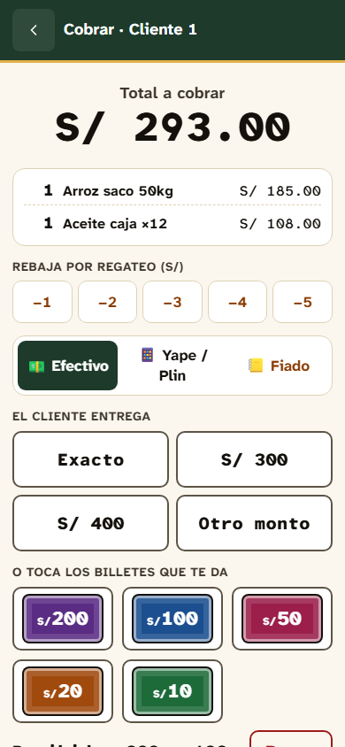</td>
<td valign="top">

- **Lista grande de lo que lleva**, para leérsela al cliente y no cobrar de menos.
- **Rebaja por regateo:** de −S/ 1 a −S/ 5 en un toque, solo para los productos que la admiten.
- **Efectivo:**
  - **Exacto**, billetes sugeridos (S/ 300, 400…) u **Otro monto**;
  - o **toca los billetes que te da el cliente** (200 + 100) y la app los suma.
- **El vuelto sale en grande y dibujado en billetes y monedas.** Si falta plata dice **"Falta S/ X"** y no deja cobrar.
- **Yape / Plin:** te recuerda **mirar el aviso en TU celular**, porque las capturas falsas son una estafa frecuente. El botón dice **"Sí llegó · Cobrar"**.
- **Fiado:** ver más abajo.
- Tocar dos veces "Cobrar" **no cobra dos veces**.

</td>
</tr>
</table>

### 🪙 Dar el vuelto

<table>
<tr>
<td width="300">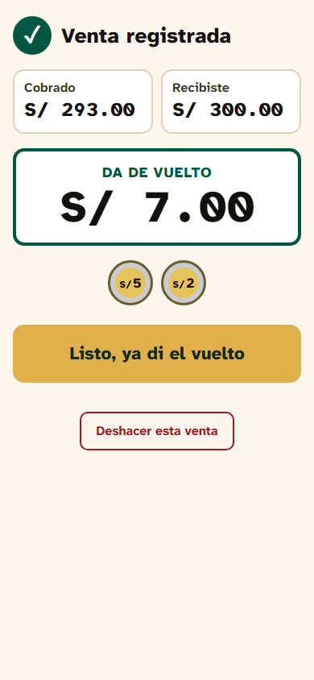</td>
<td valign="top">

Cuando hay vuelto, aparece esta pantalla y **se queda hasta tocar "Listo"**. Así nadie se olvida del vuelto con el apuro:

- lo **cobrado** y lo **recibido**;
- **"Da de vuelto S/ 7.00"** en letras enormes;
- **qué billetes y monedas entregar**, de mayor a menor (aquí: una moneda de S/ 5 y una de S/ 2);
- **"Deshacer esta venta"**, lejos del botón principal para no tocarlo por error.

Sin vuelto (pago exacto o Yape), sale un aviso de 6 segundos con **Deshacer**.

</td>
</tr>
</table>

### ✍️ Fiado con firma

<p align="center">
  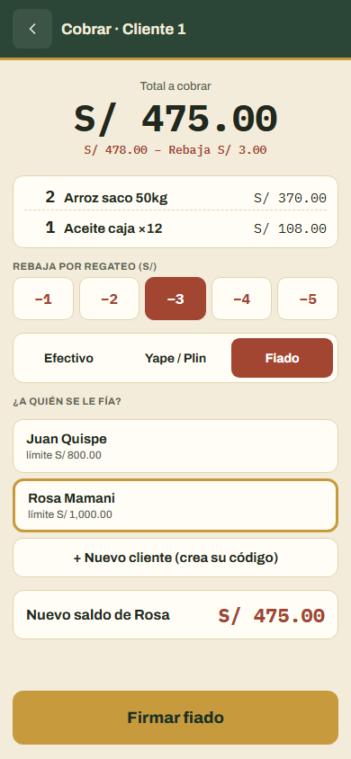
  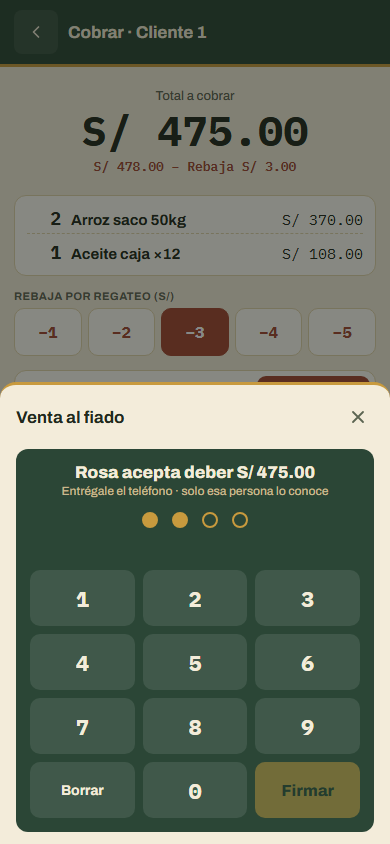
  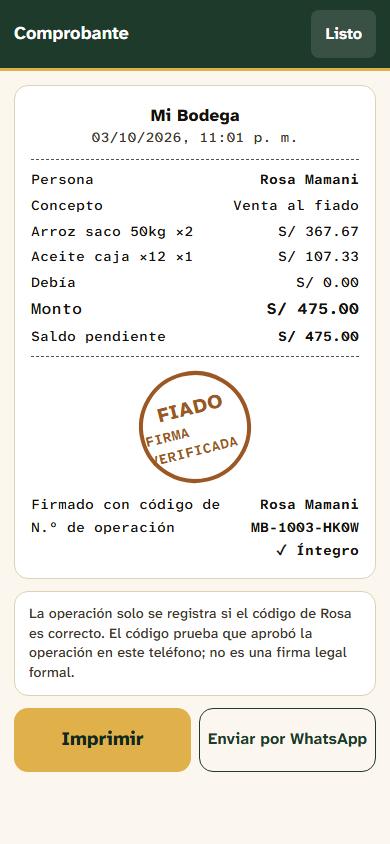
</p>

1. En Cobrar eliges **Fiado** y a la persona. Ves su deuda, su límite y el **nuevo saldo**.
2. **La persona escribe su código** en tu teléfono. Si el código no es correcto, no se guarda nada.
3. Si pasa su límite, **tú autorizas** con tu código de dueño.
4. Sale un **comprobante sellado** (FIADO / PAGADO / RECIBIDO) con número de operación, para **imprimir** o **enviar por WhatsApp**.

Para **cobrar una deuda**: Clientes y vendedores → la persona → **Cobrar deuda** (todo o una parte). La persona firma con su código.

### 👥 Clientes y vendedores (consignación)

<p align="center">
  
  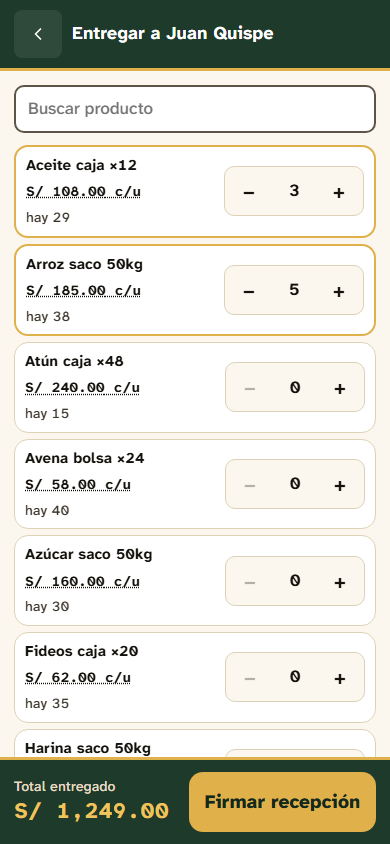
  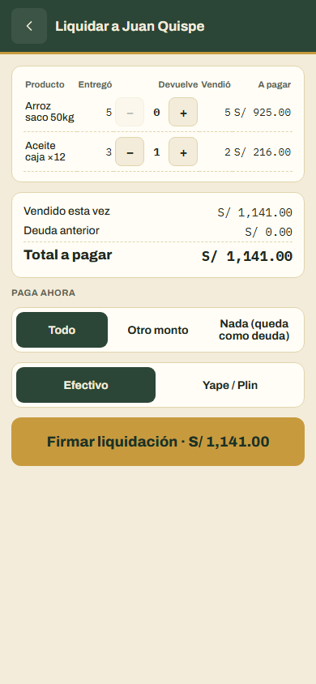
</p>

- **Lista** con lo que debe cada uno y la mercadería que tiene cada vendedor.
- **Entregar mercadería a un vendedor:** productos, cantidades, **precio pactado** (la app recuerda el último) y fecha de liquidación. El vendedor firma que la recibió.
- **Liquidar:** por producto marcas cuánto **devuelve**; lo demás cuenta como **vendido**. Total a pagar = lo vendido + la deuda anterior. Puede pagar todo, una parte o nada, y firma.
- Las entregas vencidas se marcan en rojo en la ficha y en Inicio.

### 📦 Inventario

<p align="center">
  
  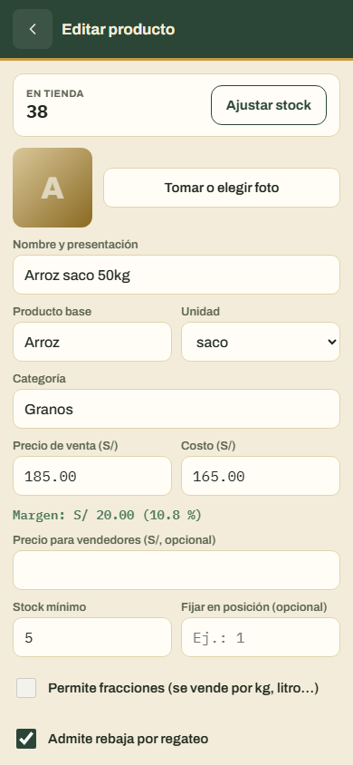
</p>

- Cada producto lleva:
  - nombre y foto (opcional);
  - precio de venta, **costo** y precio para vendedores;
  - stock mínimo;
  - si se vende por kilo y si **admite rebaja**;
  - una posición fija en la cuadrícula.
- Al editar un producto ves su **margen** al instante.
- **Ajustar stock** pide un motivo (conteo, merma, regalo) y queda registrado.
- Ves cuánto hay en tienda y cuánto con vendedores: *"30 en tienda · 10 con vendedores"*.

### 💰 Caja e 🏠 Inicio

<p align="center">
  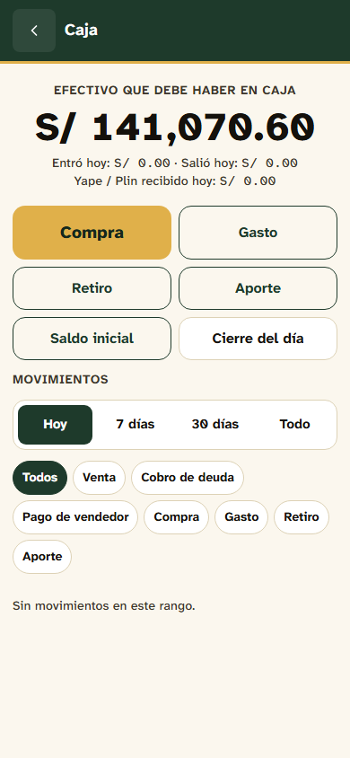
  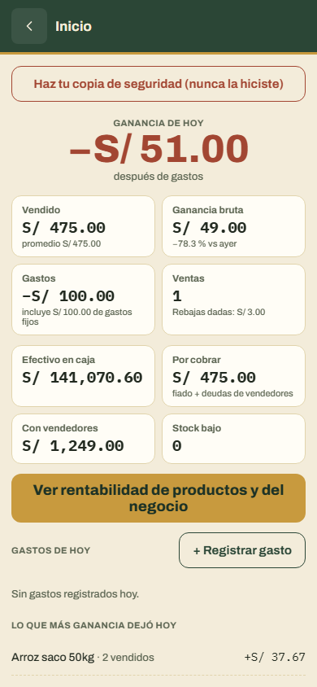
</p>

- **Caja:**
  - cuánto **efectivo debe haber**, qué entró y salió hoy, y Yape/Plin aparte;
  - **compras** a proveedor (suben el stock y actualizan el costo), **gastos**, **retiros**, **aportes** y **saldo inicial**;
  - **cierre del día**: cuentas el efectivo y la app te dice si **sobra o falta**.
- **Inicio:**
  - **ganancia de hoy** después de gastos;
  - lo vendido, el número de ventas, las rebajas dadas, lo que **te deben**, el **stock bajo** y las entregas vencidas.

### 🧾 Historial, 💾 copia de seguridad y 🌙 modo oscuro

<p align="center">
  
  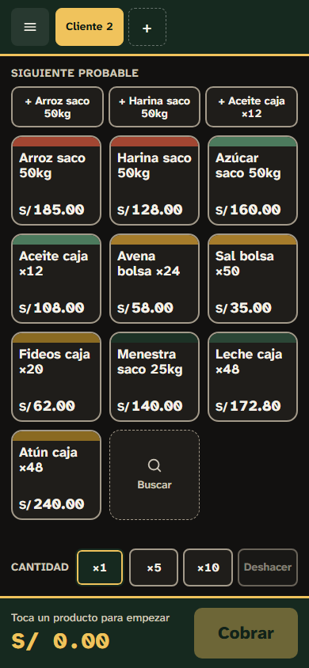
</p>

- **Historial de ventas:** reimprimir o **anular con motivo**. Las ventas de días anteriores piden tu código de dueño.
- **Copia de seguridad cifrada** (AES-256 con tu código de dueño), para enviarte por WhatsApp o Drive. La app te la recuerda cada semana.
- **Modo oscuro** para la noche o lugares cerrados.

---

## 6. Fácil de ver y de usar

<p align="center">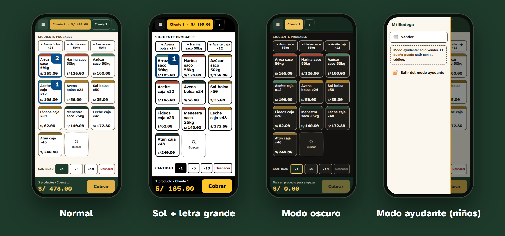</p>

La app se diseñó a partir de un **estudio con fuentes académicas** sobre puntos de venta, niños, baja visión y color ([`docs/ESTUDIO-UX.md`](docs/ESTUDIO-UX.md)). En **Ajustes → Fácil de ver y de usar**, cada teléfono elige lo suyo:

| Ajuste | Para qué sirve |
|---|---|
| 🔠 **Tamaño de letra** (Normal · Grande · Muy grande) | Para quien ve poco. Con "Muy grande" los productos van en 2 columnas para que el nombre entre completo. También respeta el tamaño de letra del teléfono. |
| ☀️ **Colores "Sol"** | Blanco y negro puros con bordes gruesos, para atender **a pleno sol**. Se activa solo si el teléfono tiene "aumentar contraste". |
| 🔊 **Leer en voz alta** | Dice el total y el vuelto: *"Vuelto: 25 soles. Da un billete de 20 soles y una moneda de 5 soles."* |
| 🧒 **Modo ayudante** | Para los hijos o un ayudante: **solo vender** en efectivo o Yape, sin cambiar precios, sin rebajas ni fiado y con el menú cerrado. **Para salir se pide el código de dueño.** Sus ventas quedan marcadas. |

**Y para todos, siempre:**
- letra **Atkinson Hyperlegible**, creada por el Braille Institute para personas con baja visión;
- **todos los textos con contraste AAA** (7:1 o más);
- colores seguros para **daltónicos**: azul cuando entra dinero y naranja cuando sale, siempre con su palabra o signo;
- el nombre del producto **nunca va encima de la foto**;
- **botones grandes** (los productos miden más de 2 cm);
- **íconos con palabras** en el menú.

---

## 7. Ganancias y análisis económico

<table>
<tr>
<td width="300">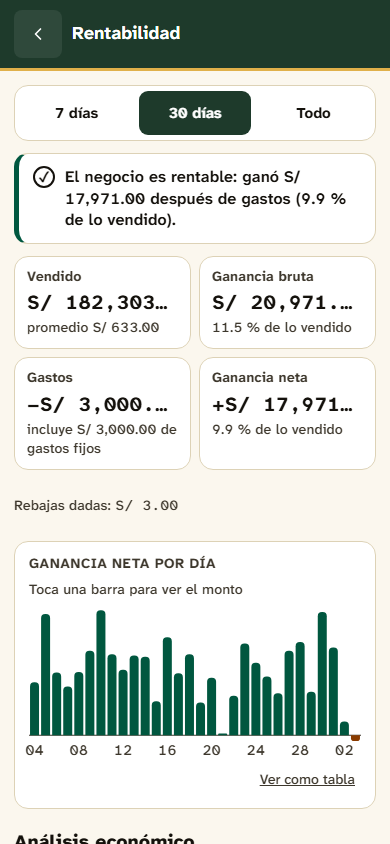</td>
<td valign="top">

En **Menú → Rentabilidad** (7 días, 30 días o todo), la app te dice en una frase **si el negocio es rentable** y cómo va frente al periodo anterior. Además da un **veredicto para cada producto**:

| Veredicto | Qué hacer |
|---|---|
| ★ **Estrella** | Que nunca te falte |
| ✓ **Bien** | Seguir igual |
| ⏳ **Se mueve lento** | Compra menos la próxima vez |
| ↓ **Margen bajo** | Revisa el precio o el costo |
| ✕ **Pierde** | Sube el precio o no lo rebajes |
| ∅ **Sin ventas** | Considera dejar de traerlo |
| ? **Sin costo** | Ponle el costo en Inventario |

</td>
</tr>
</table>

Cada indicador tiene su gráfico y un botón **"¿Qué es?"** que lo explica dentro de la app:

<table>
<tr>
<td width="50%">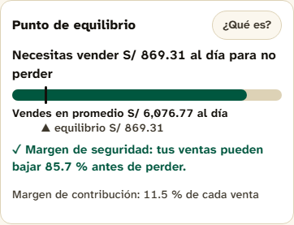</td>
<td width="50%">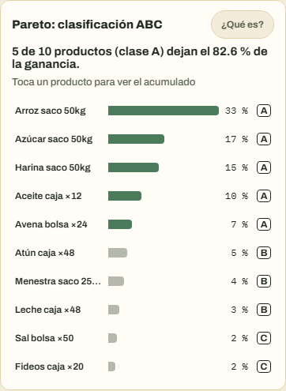</td>
</tr>
<tr>
<td valign="top"><b>Punto de equilibrio:</b> <i>"Necesitas vender S/ X al día para no perder."</i> Muestra también cuánto pueden bajar tus ventas antes de perder.</td>
<td valign="top"><b>Pareto / ABC (80/20):</b> qué pocos productos dejan casi toda la ganancia (A) y cuáles ocupan espacio y plata sin rendir (C).</td>
</tr>
<tr>
<td>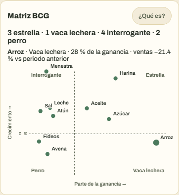</td>
<td>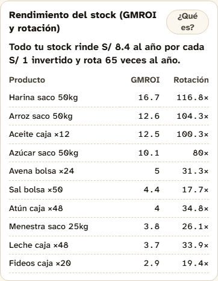</td>
</tr>
<tr>
<td valign="top"><b>Matriz BCG:</b> Estrella, Vaca lechera, Interrogante o Perro, según cuánto deja cada producto y si sus ventas crecen.</td>
<td valign="top"><b>GMROI y rotación:</b> cuántos soles de ganancia al año deja cada sol que tienes metido en stock.</td>
</tr>
</table>

> Para que los números sean reales: **pon el costo** de cada producto, los **gastos fijos del mes** en Ajustes y **registra los gastos** del día.

---

## 8. Seguridad del dinero y de los datos

| | |
|---|---|
| 🧮 **Céntimos exactos** | El dinero se calcula en céntimos enteros: nunca hay errores de redondeo en el vuelto ni en los totales. |
| 🗂️ **Nada se borra** | Ventas, gastos y movimientos se **anulan con motivo** y queda el rastro. |
| ⚛️ **Todo o nada** | Una venta descuenta el stock, registra la caja y actualiza todo junto. Si algo falla, no se guarda nada a medias. |
| 🔑 **Códigos protegidos** | El código de cada persona no se guarda: solo una huella cifrada (PBKDF2). Con 3 intentos fallidos se bloquea 5 minutos. |
| 👑 **Código de dueño** | Se pide para fiar sobre el límite, anular ventas pasadas, cambiar códigos, salir del modo ayudante y crear o restaurar copias. |
| 💾 **Copia cifrada** | Con AES-256. La app te la recuerda cada semana. |

> ⚠️ **Importante:** los datos viven en tu teléfono (y en tu PC, si los sincronizas). Si el teléfono se pierde y no hay copia, se pierden. **Haz la copia cada semana.** El código de 4 dígitos prueba que la persona aprobó la operación en tu teléfono, pero no es una firma legal formal.

<details>
<summary><b>❓ Preguntas frecuentes</b></summary>

**¿Necesito internet?**
No. La app funciona completa sin señal. Solo se necesita internet para descargar el APK y para enviar la copia o el comprobante por WhatsApp.

**Toqué ×10 y no pasó nada.**
El ×10 se aplica al **siguiente** producto que toques: primero ×10 y después el producto.

**Me equivoqué al cobrar.**
Justo después de cobrar, toca **Deshacer**. Si ya pasó, ve a Menú → Historial de ventas → la venta → **Anular venta**.

**Mi hijo va a atender. ¿Puede tocar algo que no debe?**
Activa el **modo ayudante** en Ajustes: solo podrá vender, y para salir del modo hace falta tu código.

**No veo bien las letras al sol.**
En Ajustes → Fácil de ver y de usar elige letra **Grande** y colores **Sol**.

**Un cliente olvidó su código.**
En su ficha toca **Cambiar código**. Tú escribes tu código de dueño y la persona crea uno nuevo.

**¿Por qué la ganancia de hoy sale negativa?**
Porque ya se descontó la parte del día de tus gastos fijos. Es normal en días flojos; mira la Rentabilidad de 30 días.

**¿Puedo usarla en dos teléfonos o en el teléfono y la PC?**
Sí, se sincronizan por Wi-Fi con la PC donde instalaste el programa. Varios celulares pueden vincularse a la misma PC.

**¿Cómo imprimo?**
Al cobrar, toca **Cobrar e imprimir**. También puedes reimprimir desde el Historial o el comprobante.

**Actualicé la app, ¿perdí algo?**
No. Instalar el APK nuevo encima conserva todo. Solo desinstalar borra los datos.

</details>

---

## 9. Para programadores

<table>
<tr><td><b>App</b></td><td>React 19 + TypeScript (estricto) + Vite 8</td></tr>
<tr><td><b>Offline</b></td><td>PWA con <code>vite-plugin-pwa</code> (Workbox); fuentes incluidas</td></tr>
<tr><td><b>Base de datos</b></td><td>IndexedDB con Dexie 4 (transacciones y migraciones)</td></tr>
<tr><td><b>Estado</b></td><td>Zustand (carrito, tickets en espera); lecturas con <code>useLiveQuery</code></td></tr>
<tr><td><b>Criptografía</b></td><td>WebCrypto: PBKDF2-SHA256, SHA-256, AES-GCM</td></tr>
<tr><td><b>Android</b></td><td>Capacitor 8 (impresión y voz nativas), compilado por GitHub Actions</td></tr>
<tr><td><b>PC</b></td><td><code>pc/mi-bodega.exe</code> (Rust): sirve la app, sincroniza por Wi-Fi y la abre en Comet</td></tr>
<tr><td><b>Tests</b></td><td>Vitest + fake-indexeddb (117), Playwright en teléfono 390×844 y PC 1366×768 (20 flujos)</td></tr>
</table>

<details>
<summary><b>Estructura del código</b></summary>

```
app/
  src/
    domain/      lógica pura y probada: dinero, vuelto en billetes, carrito, predicción,
                 códigos, saldos, consignación, caja, ganancias, indicadores, respaldo
    db/          esquema Dexie y una función por operación atómica
    features/    pantallas: sell, inventory, parties, consign, cash, stats, backup,
                 history, settings, sync
    sync/        sincronización por Wi-Fi con la PC (cifrado, fusión, parches)
    ui/          componentes compartidos (Sheet, NumPad, PinPad, CashPieces, gráficos…)
    styles/      tokens de color con contraste AAA, modo Sol y escala de letra
    i18n/es-PE.ts  todos los textos de la interfaz
  e2e/           flujos completos, capturas y portada del README
  android/       proyecto Android (Capacitor)
pc/              programa de Windows e instalador
docs/            capturas, imágenes de presentación y estudio de usabilidad
mi-bodega-handoff/  especificación original (SPEC, modelo de datos, diseño)
PLAN.md          fases, decisiones tomadas y propuestas pendientes
```

</details>

<details>
<summary><b>Comandos</b></summary>

```bash
cd app
npm install
npm run dev            # servidor en la red local (ábrelo desde el teléfono)
npm test               # tests de dominio y base de datos
npm run e2e            # flujos en el navegador
npm run build && npm run preview   # PWA instalable y offline
npm run build:android  # copia la web al proyecto Android
npm run capturas       # regenera las capturas y las imágenes de este README
```

</details>

<details>
<summary><b>Publicación automática</b></summary>

- **APK:** cada push a `main` o a `claude/**` que toque `app/` corre los tests, compila el APK y lo publica en la release [`apk-latest`](https://github.com/1xmanMAX/ABARROTES-PRO-/releases/tag/apk-latest). Siempre se firma con la misma clave, así las actualizaciones se instalan encima.
- **Web:** cada push a `main` publica la versión web en GitHub Pages ([`pages.yml`](.github/workflows/pages.yml)).
- **Reglas del código:** las principales están en [`mi-bodega-handoff/CLAUDE.md`](mi-bodega-handoff/CLAUDE.md):
  - el dinero siempre en céntimos enteros;
  - cada operación de negocio en una sola transacción;
  - nada se borra, se anula;
  - las ventas guardan una copia del nombre, el precio y el costo de ese momento.

</details>

### Estado del proyecto

| Fase | Contenido | Estado |
|---|---|:---:|
| 1 | Vender, cobrar, inventario, recibo, sin internet | ✅ |
| 2 | "Siguiente probable" y orden por popularidad | ✅ |
| 3 | Clientes, código personal, fiado y cobro de deudas con comprobante | ✅ |
| 4 | Entregas a vendedores y liquidación | ✅ |
| 5 | Caja, cierre del día, inicio, ganancias y análisis económico | ✅ |
| 6a | Copia de seguridad cifrada con recordatorio semanal | ✅ |
| 6c | Sincronización por Wi-Fi entre la PC y los celulares | ✅ |
| — | Fácil de ver y de usar: letra grande, modo Sol, vuelto dibujado, voz y modo ayudante | ✅ |
| 6b | Impresión directa por Bluetooth (ESC/POS) | ⏳ Opcional |

Decisiones tomadas y propuestas abiertas: [`PLAN.md`](PLAN.md).

<p align="center"><sub>Hecho para el mercado, en español de Perú 🇵🇪</sub></p>
