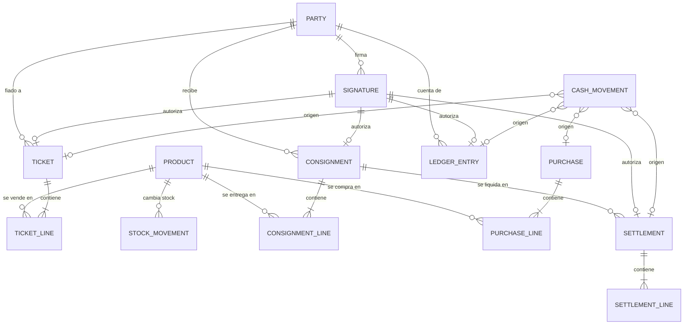

# Modelo de datos — Mi Bodega v2

Convenciones:
- Los ids son `string` (ULID, ordenables por tiempo).
- `Cents` = entero en céntimos de sol. `Qty` = entero en unidades de venta; si `allowsFraction`, en milésimas.
- Las fechas son `number` (epoch ms). `dayKey` es un `string` 'YYYY-MM-DD' en hora local de Lima.
- Toda entidad tiene `createdAt` y `updatedAt`.

## 1. Diagrama



## 2. Entidades (tablas Dexie)

### products
| Campo | Tipo | Notas |
|---|---|---|
| id | string | |
| name | string | "Arroz saco 50kg" (presentación incluida) |
| baseName | string | "Arroz" (agrupa presentaciones) |
| unit | 'saco' \| 'caja' \| 'bolsa' \| 'unidad' \| 'kg' \| 'litro' \| 'paquete' | |
| allowsFraction | boolean | por defecto false |
| category | string | |
| salePrice | Cents | |
| costPrice | Cents | último costo |
| sellerPrice | Cents \| null | precio por defecto para vendedores |
| stock | Qty | **caché** derivado de stock_movements (se actualiza en la misma transacción) |
| consignedQty | Qty | caché: en manos de vendedores |
| minStock | Qty | |
| photo | Blob \| null | ~200 KB máx. |
| tileColor | number | índice de paleta si no hay foto |
| pinnedPosition | number \| null | posición fija en la cuadrícula |
| active | boolean | los inactivos no aparecen en Vender |

Índices: `id, baseName, category, active, pinnedPosition`

### tickets
| Campo | Tipo | Notas |
|---|---|---|
| id | string | |
| number | number | correlativo por día, se muestra "#0042" |
| label | string | "Cliente 1" o nombre dado |
| status | 'open' \| 'paid' \| 'credit' \| 'void' | |
| paymentMethod | 'cash' \| 'digital' \| 'credit' \| null | |
| partyId | string \| null | obligatorio si es credit |
| subtotal / discount / total | Cents | |
| cashReceived / change | Cents \| null | |
| digitalRef | string \| null | últimos dígitos Yape |
| signatureId | string \| null | obligatorio si es credit |
| dayKey | string | |
| closedAt | number \| null | |
| voidReason / voidedAt | string / number \| null | |

Índices: `id, status, dayKey, partyId, closedAt`

### ticketLines
`id, ticketId, productId, productName (snapshot), qty, unitPrice (snapshot), unitCost (snapshot), lineTotal, lineProfit, priceOverrideReason?`
Índices: `id, ticketId, productId`

### parties
| Campo | Tipo | Notas |
|---|---|---|
| id, name, phone | | |
| roles | ('client' \| 'seller')[] | |
| creditLimit | Cents | 0 = sin fiado |
| balance | Cents | **caché** derivado de ledgerEntries |
| pin | PinRecord \| null | ver §5 |
| specialPrices | Record<productId, Cents> | precios pactados por defecto (vendedores) |
| active | boolean | |

### ledgerEntries (cuenta corriente de cada persona)
`id, partyId, type: 'charge' | 'payment' | 'adjustment', amount: Cents (siempre positivo), sourceType: 'ticket' | 'settlement' | 'manual', sourceId, signatureId, note, createdAt, voidedAt?`
- saldo = Σ charge − Σ payment ± adjustment.
Índices: `id, partyId, createdAt`

### consignments (entregas a vendedor)
`id, partyId, status: 'open' | 'settled' | 'void', dueDate, deliveredValue: Cents, signatureId, createdAt`

### consignmentLines
`id, consignmentId, productId, productName, qtyDelivered, qtyReturned (acumulado), qtySold (acumulado), agreedPrice: Cents, unitCost: Cents`
- Invariante: qtyReturned + qtySold ≤ qtyDelivered. `open` mientras la suma sea menor.

### settlements (liquidaciones)
`id, partyId, consignmentIds: string[], soldValue: Cents, previousBalance: Cents, paidNow: Cents, method, newBalance: Cents, signatureId, createdAt`

### settlementLines
`id, settlementId, consignmentLineId, productId, qtyReturned, qtySold, agreedPrice, lineTotal`

### signatures
| Campo | Tipo | Notas |
|---|---|---|
| id | string | |
| partyId | string | |
| purpose | 'credit_sale' \| 'consignment_receipt' \| 'debt_payment' \| 'settlement' | |
| amount | Cents | |
| operationCode | string | único, §5.3 |
| payloadHash | string | SHA-256 del payload canónico (§5.4) |
| createdAt | number | |

### stockMovements (fuente de verdad del stock)
`id, productId, delta: Qty (con signo), reason: 'sale' | 'sale_void' | 'purchase' | 'consign_out' | 'consign_return' | 'adjustment', refType, refId, note, createdAt`
- `products.stock` = Σ delta de las razones que afectan la tienda. `consign_out` resta de la tienda y suma a consignedQty. `consign_return` hace lo inverso. La porción vendida en la liquidación solo resta de consignedQty.

### cashMovements
`id, type: 'sale' | 'debt_payment' | 'settlement_payment' | 'purchase' | 'expense' | 'withdrawal' | 'contribution' | 'opening' | 'close_diff', method: 'cash' | 'digital', amount: Cents (con signo: + entra, − sale), refType, refId, note, dayKey, createdAt, voidedAt?`

### purchases / purchaseLines
`purchases: id, supplier, total, method, createdAt`
`purchaseLines: id, purchaseId, productId, qty, unitCost, lineTotal`

### dayCloses
`id, dayKey, expectedCash, countedCash, difference, note, createdAt`

### stats (caché de predicción, §4)
- `productStats: productId, decayedQty, lastSoldAt, byHour: number[24]`
- `pairStats: key 'a|b' (a<b), a, b, decayedCount, lastAt`

### settings (un solo registro)
`shopName, receiptFooter, paperWidth: 58 | 80, ownerPin: PinRecord, gridOrder: string[] (snapshot vigente), gridOrderComputedAt, openingCash, theme, lastBackupAt`

### auditLog
`id, action, entity, entityId, detail, createdAt`. Registra anulaciones, cambios de código, overrides de límite y ajustes de stock.

## 3. Operaciones atómicas (una transacción cada una)

| Función | Tablas | Validaciones clave |
|---|---|---|
| `checkoutTicket(ticketId, payment)` | tickets, ticketLines, products, stockMovements, cashMovements, productStats, pairStats | stock suficiente, total > 0, efectivo ≥ total |
| `checkoutOnCredit(ticketId, partyId, pinAttempt, ownerOverride?)` | + ledgerEntries, signatures, parties | PIN válido, límite o override de dueño |
| `voidTicket(ticketId, reason, ownerPin?)` | tickets, products, stockMovements, cashMovements o ledgerEntries, auditLog | owner PIN si es de otro día |
| `receiveDebtPayment(partyId, amount, method, pinAttempt)` | ledgerEntries, parties, signatures, cashMovements | amount ≤ balance |
| `deliverConsignment(partyId, lines, dueDate, pinAttempt)` | consignments, consignmentLines, products, stockMovements, signatures | stock suficiente |
| `settleConsignments(partyId, returns, paidNow, method, pinAttempt)` | settlements, settlementLines, consignmentLines, consignments, products, stockMovements, ledgerEntries, parties, cashMovements, signatures, productStats | devuelto ≤ pendiente, paidNow ≤ total |
| `registerPurchase(...)`, `registerCashMovement(...)`, `adjustStock(...)`, `closeDay(...)` | según corresponda | |

La verificación del PIN ocurre **antes** de abrir la transacción (PBKDF2 es asíncrono y lento a propósito). El resultado se pasa a la transacción, y el contador de intentos se actualiza en su propia transacción.

## 4. Algoritmos de predicción

Constantes: `HALF_LIFE_DAYS = 30`, `λ = ln2 / HALF_LIFE_DAYS`.

### 4.1 Orden de la cuadrícula
- Al confirmar cada venta, para cada producto: `decayedQty = decayedQty · e^(−λ·Δdías) + qty` (Δ desde lastSoldAt), y `byHour[hora] += qty`.
- `gridOrder` = primero los fijados en su posición, y el resto ordenado por `decayedQty` actual descendente (con desempate por nombre).
- Se recalcula **solo** en los momentos de SPEC §2.2 y se guarda en `settings.gridOrder`. La UI lee ese snapshot y no calcula en caliente.

### 4.2 "Siguiente probable"
- Al cerrar cada ticket (pagado, fiado o por liquidación), para cada par {a,b} distinto de productos del ticket: `pairStats[a|b].decayedCount` decae y suma 1.
- Con el carrito C no vacío, para cada candidato p ∉ C con stock:
  `score(p) = Σ_{c∈C} decayedCount(c,p) / (1 + decayedQty(c))^0.5  +  0.15 · norm(decayedQty(p))  +  0.10 · norm(byHour_p[horaActual])`
  - El primer término es la afinidad con lo que ya lleva, suavizada para que un producto muy vendido no domine todas las predicciones.
  - Los otros dos son la popularidad general y la hora del día, como desempate.
- Con el carrito vacío: `score(p) = 0.6 · norm(byHour_p[hora]) + 0.4 · norm(decayedQty(p))`.
- Se toman los 3 mejores. Para evitar parpadeo, un candidato que ya se muestra solo se reemplaza si otro lo supera por más del 10 %.
- Arranque en frío (menos de 20 tickets): solo popularidad.
- Todo en memoria: se cargan `productStats` y `pairStats` al iniciar, se actualizan en memoria al cerrar un ticket y se persisten en la misma transacción. 60 productos → máx. 1 770 pares, cálculo trivial.

## 5. Código personal (PIN)

### 5.1 PinRecord
```ts
type PinRecord = {
  hash: string;        // base64 de PBKDF2-SHA256
  salt: string;        // 16 bytes aleatorios, base64
  iterations: number;  // 210_000 (ajustar para que tarde ~250 ms en el teléfono)
  failedCount: number;
  failedWindowStart: number | null;
  lockedUntil: number | null;
  requiresOwnerReset: boolean;
  setAt: number;
};
```

### 5.2 Verificación
- `verifyPin(record, attempt)` recalcula PBKDF2 y compara en tiempo constante.
- Bloqueos: 3 fallos → `lockedUntil = now + 5 min`. 6 fallos en 24 h → `requiresOwnerReset = true`.
- Un acierto reinicia los contadores.
- Rechazar PINs triviales al crearlos (SPEC §9.1).
- Nota de seguridad para documentar: 4 dígitos son 10 000 combinaciones. La protección real viene del bloqueo por intentos y de que la operación ocurre en presencia del dueño. No es criptografía fuerte contra alguien con acceso al archivo de la BD. Es aceptable para este uso y se documenta así.

### 5.3 N.º de operación
- Formato `MB-MMDD-XXXX`, donde XXXX usa el alfabeto Crockford base32 sin I, L, O ni U (por ejemplo `MB-0926-4K7Q`).
- Se genera con `crypto.getRandomValues` y se verifica que sea único en `signatures`.

### 5.4 Hash del payload
- `payloadHash = SHA-256(JSON canónico {purpose, partyId, amount, lines[], createdAt, operationCode})`.
- Permite detectar si un registro firmado fue alterado después: la pantalla del comprobante recalcula el hash y muestra "Íntegro" o "Modificado".

## 6. Reglas de dinero

- `change = cashReceived − total`. Si es negativo, no se permite confirmar.
- Botones de billetes: siguiente múltiplo de 10, 50, 100 y 200 mayor o igual al total, sin duplicados, máx. 3 + Exacto + Otro.
- Ganancia de línea = lineTotal − qty × unitCost (costo snapshot).
- En la liquidación, el precio de venta es agreedPrice y el costo es el unitCost snapshot de la entrega.
- Redondeo: ninguno interno. El descuento de línea es explícito.

## 7. Datos de ejemplo (seed para desarrollo)

Productos: Arroz saco 50kg (S/ 185, costo 165), Azúcar saco 50kg (160/142), Harina saco 50kg (128/112), Aceite caja ×12 (108/96), Avena bolsa ×24 (58/50), Fideos caja ×20 (62/54), Leche caja ×48 (172.80/156), Atún caja ×48 (240/215), Menestra saco 25kg (140/122), Sal bolsa ×50 (35/28).
Personas: Rosa Mamani (cliente, límite S/ 1,000), Juan Quispe (vendedor, límite S/ 800), PIN de prueba 2580.
Historial sintético: 300 tickets en 30 días con pares frecuentes (Arroz+Aceite, Arroz+Avena, Azúcar+Harina), para poder probar la predicción.
